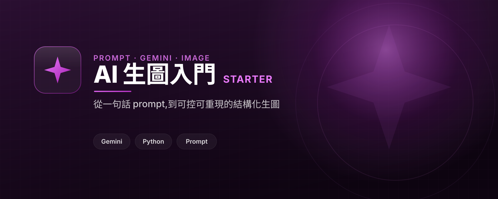

# Gemini Image Starter

Learn AI image generation: from a naive one-line prompt (Part 1) to structured, controllable prompt design with a minimal Gemini client (Part 2).

## 繁中定位

**AI 生圖入門 · 繪圖魔法師(基礎模組)** 面向台灣繁中受眾。

- 主要受眾:第一次用 AI 生圖、想學會「讓結果可控」的人。
- 核心承諾:從一句話 prompt(每次都不一樣)走到結構化 prompt(可控、可重現),看懂「核心魔法是 prompt 設計」。
- 引擎:Google Gemini(`gemini-2.5-flash-image`)。
- 系列定位:這是「繪圖魔法師」系列的基礎/前置模組。
- CTA 頁:https://yazelin.github.io/gemini-image-starter/

## Part 1 vs Part 2

- **Part 1(baseline,`part1_naive/naive.py`)** — 一句話 prompt `"a cat"`。會生出一張貓,但每次都不一樣:姿勢、畫風、背景、光線全是模型替你決定的。要拿來做產品(貼圖、頭像、角色)時,這種「每次都隨機」就是痛點。
- **Part 2(`app/prompt.py` + `app/gen.py` + `demo_structured.py`)** — 結構化 prompt:主體 / 風格 / 光線 / 構圖 / 配色 / 負面詞。同樣的輸入 → 同樣的描述 → 可控、可重現。這就是「繪圖魔法師」的第一個魔法:**prompt 設計**。

## Who this is for

第一次接觸 AI 生圖、想把「每次都隨機」變成「我說了算」的人;以及想把生圖接進自家流程的開發者。

## Features

- 結構化 prompt builder(`app/prompt.py`)— 純函式,同輸入同輸出,易測。
- 對齊真實 Gemini 的 image client(`app/gen.py`)— `base_url` 可注入,所以測試能指向本地假 server。
- Part 1 baseline 與 Part 2 結構化 demo 並列對照。
- 免 API key 的確定性測試:prompt builder、請求/回應形狀、對本地假 Gemini server 跑完整 build → POST → 解析 → 存檔。

## Quick start

本教學以 [uv](https://docs.astral.sh/uv/) 為主。`uv sync` 會依 `pyproject.toml` + `uv.lock` 自動建立 `.venv` 並把依賴裝好(毋須手動 venv / activate),`uv run` 直接在那個環境裡執行。**以下 `uv sync` / `uv run` 在 Ubuntu 與 Windows 完全相同。**

先安裝 uv(一次就好):

- Ubuntu / macOS:`curl -LsSf https://astral.sh/uv/install.sh | sh`
- Windows(PowerShell):`powershell -ExecutionPolicy ByPass -c "irm https://astral.sh/uv/install.ps1 | iex"`

裝完重開終端機,`uv --version` 印得出版本就 OK。

```
git clone https://github.com/yazelin/gemini-image-starter.git
cd gemini-image-starter
uv sync
uv run python client_smoke_test.py
```

`client_smoke_test.py` 跑全部確定性測試(免 API key、免網路)。真實輸出:

```
== tests/test_prompt.py ==
OK: prompt builder test passed

== tests/test_request.py ==
OK: request/response shaping test passed

== tests/test_gen_fake.py ==
OK: gen against fake Gemini server passed

OK: all checks passed
```

## 真正生圖(需要 API key)

確定性測試不需要 key。要真的生出圖,才需要免費的 `GEMINI_API_KEY`(免費申請:https://aistudio.google.com/apikey )。

Part 1 baseline(每次都不一樣):

```
GEMINI_API_KEY=xxx uv run python part1_naive/naive.py
```

Part 2 結構化(同樣的欄位 → 同樣的描述):

```
GEMINI_API_KEY=xxx uv run python demo_structured.py
```

`demo_structured.py` 的 `build_prompt` 會印出:

```
a cat sitting by a window, style: ukiyo-e woodblock print, lighting: soft morning light, composition: centered, close-up, color palette: muted indigo and gold. Avoid: text, watermark, extra limbs
```

## Prompt builder(核心魔法)

`app/prompt.py` 是純函式的結構化 prompt builder。把每個決定(主體 / 風格 / 光線 / 構圖 / 配色 / 額外 / 負面詞)變成具名欄位,`negative` 會變成模型視為「要避開」的 `Avoid: ...` 子句:

```python
from app.prompt import build_prompt

build_prompt(
    "a cat sitting by a window",
    style="ukiyo-e woodblock print",
    lighting="soft morning light",
    composition="centered, close-up",
    color="muted indigo and gold",
    negative="text, watermark, extra limbs",
)
# -> "a cat sitting by a window, style: ukiyo-e woodblock print, lighting: soft morning light, composition: centered, close-up, color palette: muted indigo and gold. Avoid: text, watermark, extra limbs"
```

同樣的輸入永遠產生同樣的字串。沒有網路、沒有 key,所以完全確定性、好測。

## Gen client(對齊真實 Gemini)

`app/gen.py` 是對齊真實 Google Gemini image API 的最小 client,同一份程式碼能打真實服務、也能在測試裡打本地假 server:

```
POST {base_url}/{model}:generateContent?key={api_key}
body: {"contents":[{"parts":[{"text": prompt}]}],
       "generationConfig":{"responseModalities":["IMAGE"]}}
resp: candidates[0].content.parts[].inlineData.data   (base64 image)
```

- `build_request_body(prompt)` — 純函式,把 prompt 變成 generateContent 的 body。
- `extract_image(result)` — 純函式,從回應抓第一張 inline 圖、base64 解碼;沒有圖就丟出清楚的 `ValueError`。
- `generate(prompt, api_key, *, model=..., base_url=...)` — 真正打 API 並回傳圖的 bytes。**`base_url` 可注入**,所以測試指向本地假 server。
- `save_image(data, path)` — 存成檔。

預設模型 `gemini-2.5-flash-image`(fallback:`gemini-2.0-flash-exp-image-generation`)。

## Tests

三組確定性測試,全部免 API key、免網路:

- [`tests/test_prompt.py`](tests/test_prompt.py) — prompt builder(純函式,含「同輸入同輸出」與「只給主體」兩個邊界)。
- [`tests/test_request.py`](tests/test_request.py) — 請求 body 形狀 + `extract_image` 抓圖 / 解碼 / 無圖報錯。
- [`tests/test_gen_fake.py`](tests/test_gen_fake.py) — 對 [`tests/fake_gemini.py`](tests/fake_gemini.py)(本地假 Gemini server,回固定 1x1 PNG)跑完整 build → POST → 解析 → 解碼 → 存檔。

`client_smoke_test.py` 一次跑完上面三組。

```
uv run python client_smoke_test.py
```

這個 starter 只在執行 `gen` 時用到 `httpx`,測試走本地假 server,所以照著上面的 quickstart 跑不會打到外部網路、也不消耗 API 額度。

## Learn / get help

This repo is also a CTA page for workshops and consulting:

- GitHub Pages: https://yazelin.github.io/gemini-image-starter/
- Contact: yazelin@ching-tech.com

## 延伸資源

學會 prompt 設計後,可以接這些作者自己做的繪圖周邊:

- **PromptFill** — 結構化提示詞工具:[github.com/yazelin/PromptFill](https://github.com/yazelin/PromptFill)
- **prompts-vault** — Nano Banana prompt 收集站:[mukiwu.github.io/prompts-vault](https://mukiwu.github.io/prompts-vault/)

把生圖做成正式產品的真實案例:

- **line-sticker-studio** — AI 生圖 → LINE 貼圖工作流:[github.com/yazelin/line-sticker-studio](https://github.com/yazelin/line-sticker-studio)
- **catime** — 把生圖玩成成品:[github.com/yazelin/catime](https://github.com/yazelin/catime)

## License

MIT

## Brand / CTA design

- Landing page: https://yazelin.github.io/gemini-image-starter/
- CI spec: [DESIGN.md](DESIGN.md)
- Banner: [assets/banner.svg](assets/banner.svg)
- Logo: [assets/logo.svg](assets/logo.svg)

---

## 關於作者

這個範本由 **林亞澤(Yaze Lin)** 維護 —— 出身機電自動化系統整合,現在把同一套工程方法用在 AI 產品上。

- 任職於 **擎添工業 ChingTech**(1984 年成立的機電自動化公司:PLC 程式、機械手臂、AGV 無人搬運、半導體封測/PCB/面板/光學產線整合)。
- 技術筆記與更多範例:[yazelin.github.io](https://yazelin.github.io) · GitHub [@yazelin](https://github.com/yazelin)

## 從範本到正式產品

> 把 AI 生圖做成真正出貨的東西,我們已經做過:line-sticker-studio、catime,以及企業端的 CTOS。

如果你想看同樣的想法做成正式、上線中的產品:

- **line-sticker-studio** — 把 AI 生圖做成 LINE 貼圖工作流:[github.com/yazelin/line-sticker-studio](https://github.com/yazelin/line-sticker-studio)
- **catime** — 把生圖玩成成品的實戰案例:[github.com/yazelin/catime](https://github.com/yazelin/catime)
- **CTOS** — 企業 AI 工作平台:macOS 風格 Web 桌面、知識庫 RAG 檢索、產業專屬 Agent、LINE Bot 整合,資料留在台灣。[ching-tech.com](https://ching-tech.com) · [品牌站](https://ching-tech.github.io)
- **CTOS-Lite / CT JINN** — 把公司裝進 LINE 的個人版 AI 助理,加 LINE 即可試用:[@285fjkky](https://line.me/R/ti/p/@285fjkky)

> 想把生圖落地成你公司的內部工具,或想上一堂從 0 到部署的課?
> 來信 yazelin@ching-tech.com,或追蹤上面的連結。
